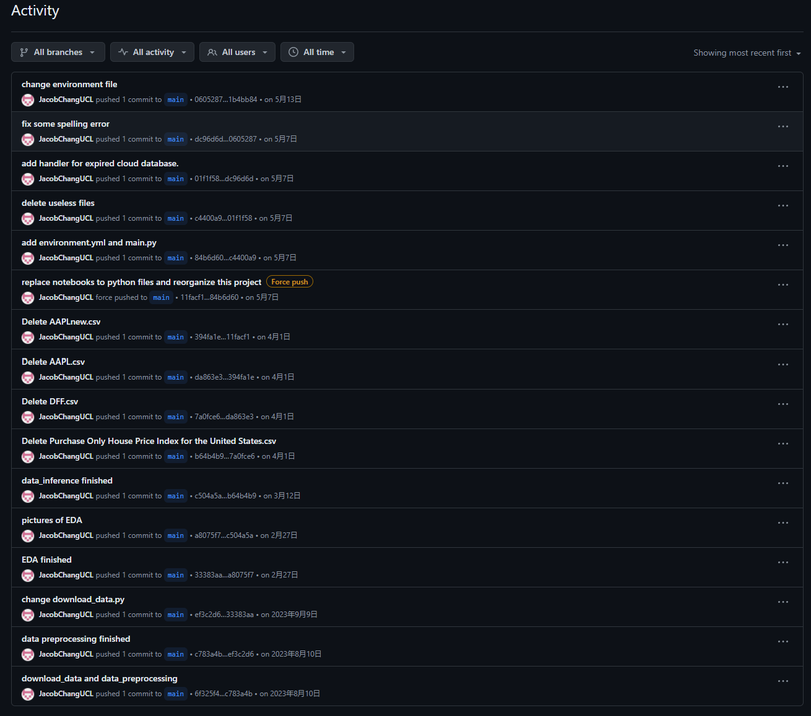

# Data Acquisition and Processing Systems (DAPS) (ELEC0136)
 This repository contains the final assignment for the DAPS.  
This project aims to implement the entire DAPS workflow (data acquisition, storage, preprocessing, visualization, EDA, inference) to predict the stock prices of Apple Inc. (AAPL).

```plaintext
Stock-Prediction/
├── data/                             # Data Files Directory
│   ├── AAPL.csv                      # AAPL Raw Data
│   ├── AAPL_preprocessed.csv         # Preprocessed AAPL Data
│   ├── ALL.csv                       # Data Integration 
│   ├── ALL_cleaned.csv               # Integrated and preprocessed data
│   ├── DFF.csv                       # DFF Raw Data
│   ├── DFFnew.csv                    # Preprocessed DFF Data
│   ├── T10Y2Y.csv                    # T10Y2Y Raw Data
│   └── T10Y2Ynew.csv                 # Preprocessed T10Y2Y Data
├── figures/                          # Image Files
│   ├── .....png                      # Too many to list,please check image names
│
├── DAPS Assignment_2022_2023.pdf     # Assignment Description
├── src/                              # Source Code Files
│   ├── __init__.py
│   ├── cloud_database.py             # Cloud Database Code,including CRUD operations
│   ├── data_inference.py             # Data Inference Code,using Facebook Prophet model
│   ├── data_preprocessing.py         # Data Cleaning and Preprocessing Code
│   ├── download_data.py              # Data Downloading Code,using Yahoo Finance API and Requests
│   ├── EDA.py                        # Exploratory Data Analysis Code
│   └── visualization.py              # Data Visualization Code
├── jupyter notebook version codes/   # Jupyter Notebook Codes,display how the original code was built step by step.
│   ├── data_inference.ipynb          
│   ├── EDA.ipynb                     
│   └── visualization.ipynb           
├── environment.yml                   # Environment Configuration File
├── README.md                         # Project Description File
└── main.py                           # Main Program File,run this file to execute the entire project
```
usage:
download this repository:  
```
git clone https://github.com/JacobChangUCL/Stock-Prediction
```
build the environment:
```
conda env create -f environment.yml
```
run the main program:
```
python main.py
```
The information of historical submissions can be found below if you can't enter this page https://github.com/UCL-ELEC0136/final-assignment-JacobChangUCL 



